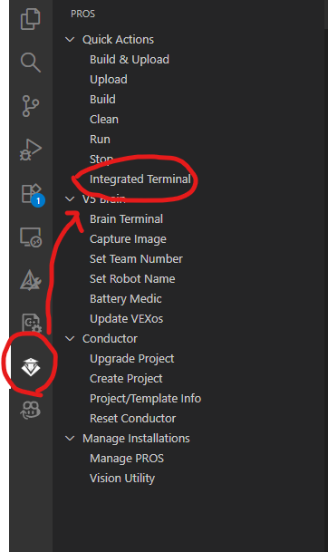
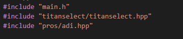
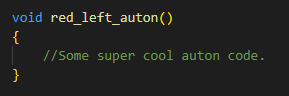
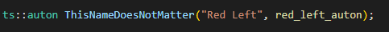
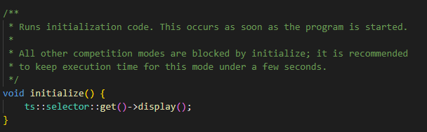
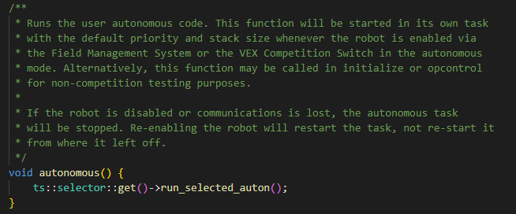

# Titanselect guide

# Installing

To begin using Titanselect, you first need to install it. This can be done through the command line and the pros conductor.

First, you should click the pros icon on the sidebar of Visual Studio Code and from there press the integrated terminal button. After that a terminal should appear **on the bottom** of Visual Studio Code.



After that, run the following commands in order to **install Titanselect**.

```pros c add-depot titanselect https://raw.githubusercontent.com/tubaplayerdis/titanselect/refs/heads/main/depot.json```

```pros c apply titanselect@1.0.0```

# Basic Setup

After that, include Titanselect into your **main.cpp** file at the top (make sure to include the .hpp file not .h as that is the C api header file)

```cpp
#include "titanselect/titanselect.hpp"
```

Your main.cpp should look something like this (there might be extra includes, in this case I am also using the adi api):



# Creating an auton

After that, you can create autons by first defining a function that contains the code for them. An example is pictured below:

**NOTE:** The function that contains the auton code has to return void and take no arguments.



Next, create a ts::auton. The auton can be named anything as what appears on the selector is passed in the first argument. You then supply the auton function in the second argument with no parentheses. An example that fits the function below is pictured:



Your auton should now show up. Here is a complete example to provide a little more context.

### Complete Example:

```cpp
void red_left_auton()
{
	//Some super cool auton code.
}

ts::auton ThisNameDoesNotMatter("Red Left", red_left_auton);
```

Fun fact: autons can be created inside header and source files.

## Displaying the selector

For simplicity, the selector will be accessed using its get() method for this part.

Inside your **initialize** function, add the following line:

```cpp
ts::selector::get()->display();
```

Your initialize should look like this now (there might be other stuff that you are initializing)



You can also hide the selector if you want to display other things on the screen with the `ts::selector::get()->hide()` function.

## Running an auton

You're almost there! Now add this line into your **autonomous** function to run the select auton during autonomous.

```cpp
ts::selector::get()->run_selected_auton();
```

Your autonomous function should look like this now:



# Complete basic example

Here is a complete example for more context incase you were confused.

```cpp
#include "main.h"
#include "titanselect/titanselect.hpp"

void red_left_auton()
{
	//Some super cool auton code.
}

void blue_right_auton()
{
    //Some super cool auton code.
}

void blue_left_auton()
{
    //Some super cool auton code.
}

void red_right_auton()
{
    //Some super cool auton code.
}

ts::auton rl("Red Left", red_left_auton);
ts::auton br("Blue Right", blue_right_auton);
ts::auton rr("Red Right", red_right_auton);
ts::auton bl("Blue Left", blue_left_auton);

/**
 * Runs initialization code. This occurs as soon as the program is started.
 *
 * All other competition modes are blocked by initialize; it is recommended
 * to keep execution time for this mode under a few seconds.
 */
void initialize() {
	ts::selector::get()->display();
}

/**
 * Runs while the robot is in the disabled state of Field Management System or
 * the VEX Competition Switch, following either autonomous or opcontrol. When
 * the robot is enabled, this task will exit.
 */
void disabled() {}

/**
 * Runs after initialize(), and before autonomous when connected to the Field
 * Management System or the VEX Competition Switch. This is intended for
 * competition-specific initialization routines, such as an autonomous selector
 * on the LCD.
 *
 * This task will exit when the robot is enabled and autonomous or opcontrol
 * starts.
 */
void competition_initialize() {}

/**
 * Runs the user autonomous code. This function will be started in its own task
 * with the default priority and stack size whenever the robot is enabled via
 * the Field Management System or the VEX Competition Switch in the autonomous
 * mode. Alternatively, this function may be called in initialize or opcontrol
 * for non-competition testing purposes.
 *
 * If the robot is disabled or communications is lost, the autonomous task
 * will be stopped. Re-enabling the robot will restart the task, not re-start it
 * from where it left off.
 */
void autonomous() {
	ts::selector::get()->run_selected_auton();
}

/**
 * Runs the operator control code. This function will be started in its own task
 * with the default priority and stack size whenever the robot is enabled via
 * the Field Management System or the VEX Competition Switch in the operator
 * control mode.
 *
 * If no competition control is connected, this function will run immediately
 * following initialize().
 *
 * If the robot is disabled or communications is lost, the
 * operator control task will be stopped. Re-enabling the robot will restart the
 * task, not resume it from where it left off.
 */
void opcontrol() {
    //Your code
}
```

# Dive deeper

Interested in doing more? Check out the C++ api documentation!

[Titanselect C++ API](CPPDOCS.MD)

You can also message me on the Vex Robotics Competition Discord and Robolytics Discord. My username is `tbgit` (Display Name: Aaron | 38535A)

If you are also local in the illinois region, feel free to come say hi or ask questions if we are there.