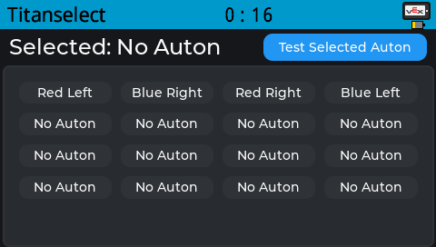
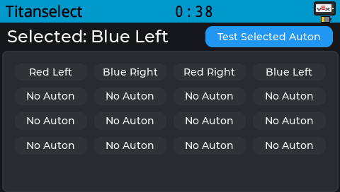

# Titanselect

#### Documentation

[Titanselect C API](CDOCS.MD) 
[Titanselect C++ API](CPPDOCS.MD)

Titanselect is a simple visual atuon selector that works on pros. Titanselect was created as a simple auton selector to be used by vex team 38535A after robodash went OOS (Out Of Support)

**NOTE:** Titanselect uses **LVGL 9**. Make sure you have to latest pros version installed that supports lvgl 9 to use Titanselect

### Access Command Line to install/update

Go to the pros extension icon on the sidebar vs code and click it, then press `integrated terminal`. A terminal should popup at the bottom and you can paste the commands to install/update.


## Update Titanselect

```pros c upgrade```

## Install Titanselect

> [!NOTE]
> **Titanselect ONLY SUPPORTS PROS V2.4.1+** 

### Install depot

```pros c add-depot titanselect https://raw.githubusercontent.com/tubaplayerdis/titanselect/refs/heads/main/depot.json```

### Apply latest version (1.0.0)

```pros c apply titanselect@1.0.0```

## Usage

Titanselect has both a C and C++ api. to take advantage of each, include the respective `titanselect.h`(C) or `titanselect.hpp`(CPP).

read the following documentation for each language:

[Titanselect C API](CDOCS.MD) 
[Titanselect C++ API](CPPDOCS.MD)

### Showcase




### Features

Titanselect is a relatively simple but has a few key features that make it great,

 - **Automatic auton saving/loading from file** - Titanselect will automatically save/load your last used autons so you dont have to worry about an auton not running or having to reselect an auton pre-match. **(A Micro-SD has to be inserted and read/writeable for this to work)**

 - **Grid style Selector** - Titanselects's grid style selector makes choosing autons simple and straightforward to maximize your time writing autons instead of trying to get your auton selector to work.
